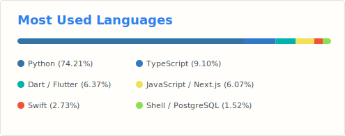

# Hi there, I'm Shanchoy!

**Building the future, one system at a time.**

Tech-driven entrepreneur and creative strategist focused on automation, AI, and building scalable digital ventures. Currently developing Choy AI — a JARVIS-style assistant powered by LLM, and deployed using VPS, Docker, and Telegram bots. A cross-platform interface is underway, including a Next.js web app and future Flutter-based mobile experience.

## **About Me:**
* **Founder**: Choy AI → Choy Agency Ltd. → Choy Wear → Choy Group (building a global portfolio)
* **Background**: Self-taught full-stack developer with AI expertise and 8+ years in technical support, UI/UX, video editing, and systems thinking
* **Based**: Dhaka, Bangladesh (next stop: Dubai)
* **Mission**: Financial freedom through tech, fashion, and digital ventures
* **Specialty**: Turning complex problems into elegant automated solutions

---
*"Think systems. Build empires. Optimize everything."*

## **Current Focus:**
* Building Choy AI - JARVIS-style automation assistant
* Scaling digital ventures across multiple verticals
* Crypto investments & DeFi strategies
* Systems architecture & process optimization

## **Let's Connect:**
* 💼 LinkedIn: [shanchoynoor](https://linkedin.com/in/shanchoynoor)
* 💬 Telegram: [@shanchoynoor](https://t.me/shanchoynoor)
* 📧 Email: [shanchoy.noor@gmail.com](mailto:shanchoy.noor@gmail.com)
* 🌐 Website: [shanchoynoor.com](https://shanchoynoor.com) *(Currently Offline)*

## **📊 Statistics**

  

 
 

          
